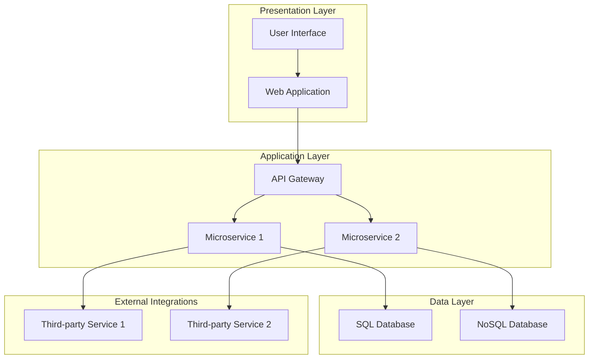

Certainly! Below is a LinkedIn post with a title, body, and footer, followed by the markdown code containing the Mermaid.js diagram for a high-level system architecture.

---

**Title:** Crafting a Robust System Architecture with Mermaid.js

**Body:**

As a Solutions Architect, visualizing system architecture is crucial for effective communication and understanding of complex systems. Today, I'm excited to share a high-level architecture diagram created using Mermaid.js. This diagram showcases a typical architecture with various layers, technology choices, external integrations, and data storage.

In the architecture, we have:
- **Presentation Layer:** Interacting with users via a web application.
- **Application Layer:** Where business logic is implemented using microservices.
- **Data Layer:** Managing data storage with a combination of SQL and NoSQL databases.
- **External Integrations:** Seamlessly connecting with third-party services for extended functionalities.

The diagram is organized into subgraphs for a clearer representation of each layer. Connections illustrate data flow and interactions between components, providing a comprehensive view of the architecture.

I hope this visual serves as a helpful guide for anyone looking to design or understand system architectures. Your thoughts and feedback are always welcome!

**Footer:**

#SystemArchitecture #MermaidJS #SolutionsArchitect #TechDesign #DataFlow

---

Below is the markdown file with the Mermaid.js code block:

```markdown

```

You can copy and paste the markdown code into any markdown editor that supports Mermaid.js to visualize the diagram. This code provides a clear representation of a high-level system architecture with well-defined layers and connections.