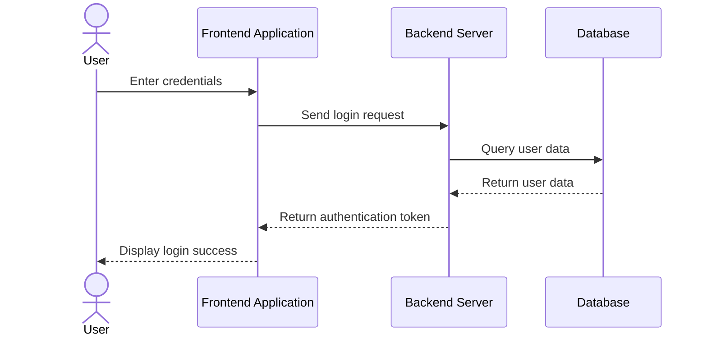
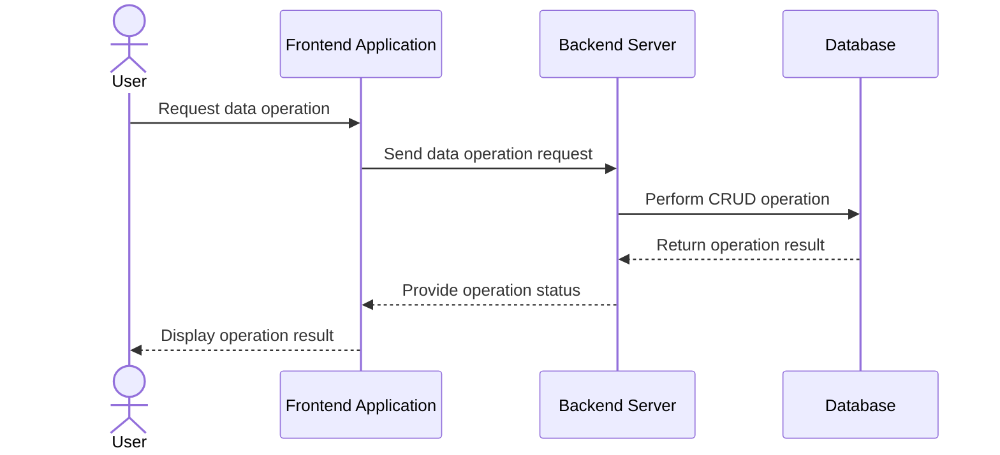
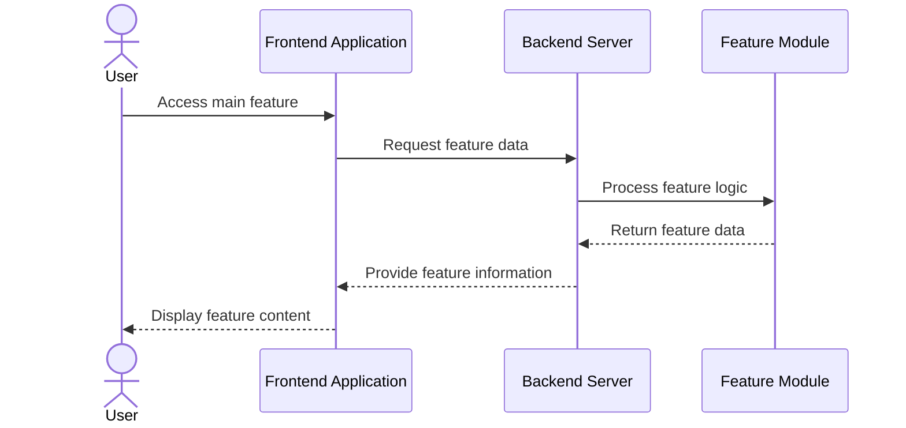

Certainly! Below is a sample LinkedIn post for the "LinkedinBlog Generator" project, along with a markdown file containing Mermaid.js sequence diagrams for the key user flows.

---

### LinkedIn Post

**Title:** Enhancing Software Architecture with Mermaid.js Sequence Diagrams

**Body:**
As a Software Architect, visualizing complex system interactions is crucial for effective design and communication. Today, I'm excited to share insights into using Mermaid.js for creating sequence diagrams that illustrate key user flows, from authentication to data operations and main features.

Mermaid.js is a powerful tool that enables architects to create clear and concise diagrams using a simple Markdown-like syntax. This not only improves documentation but also facilitates better collaboration among development teams. In this post, I'll showcase three essential user flows represented through Mermaid.js sequence diagrams: Authentication, Data Operations, and Core Functionalities.

1. **Authentication Flow**: Demonstrates the user login process, ensuring secure access to the system.
2. **Data Operations Flow**: Illustrates how users interact with the database, emphasizing CRUD operations.
3. **Main Features Flow**: Highlights the primary functionalities users rely on, showcasing seamless user experience.

Embracing tools like Mermaid.js empowers architects and developers to streamline processes and enhance system clarity. Dive into the world of sequence diagrams and transform your architectural documentation today!

**Footer:**
#SoftwareArchitecture #MermaidJS #SequenceDiagrams #TechInnovation #LinkedInBlogGenerator

---

### Markdown File with Mermaid.js Sequence Diagrams

```markdown
# Mermaid.js Sequence Diagrams for Key User Flows

## Authentication Flow


## Data Operations Flow


## Main Features Flow


```

These Mermaid.js diagrams help in understanding the critical user interactions within the system, ensuring that both technical and non-technical stakeholders can grasp the system's architecture efficiently.