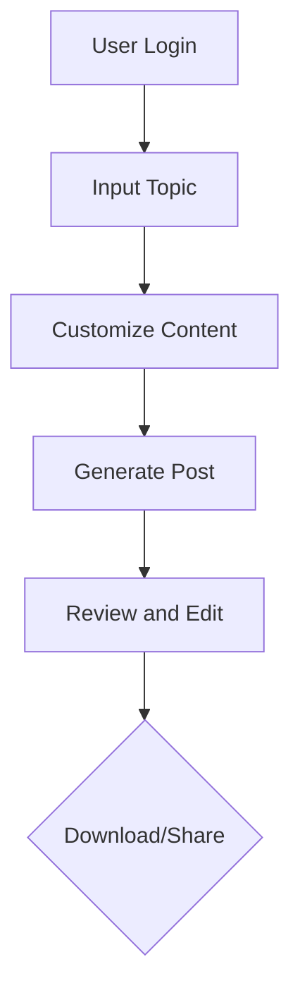
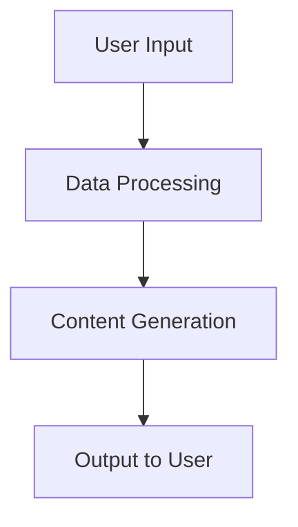
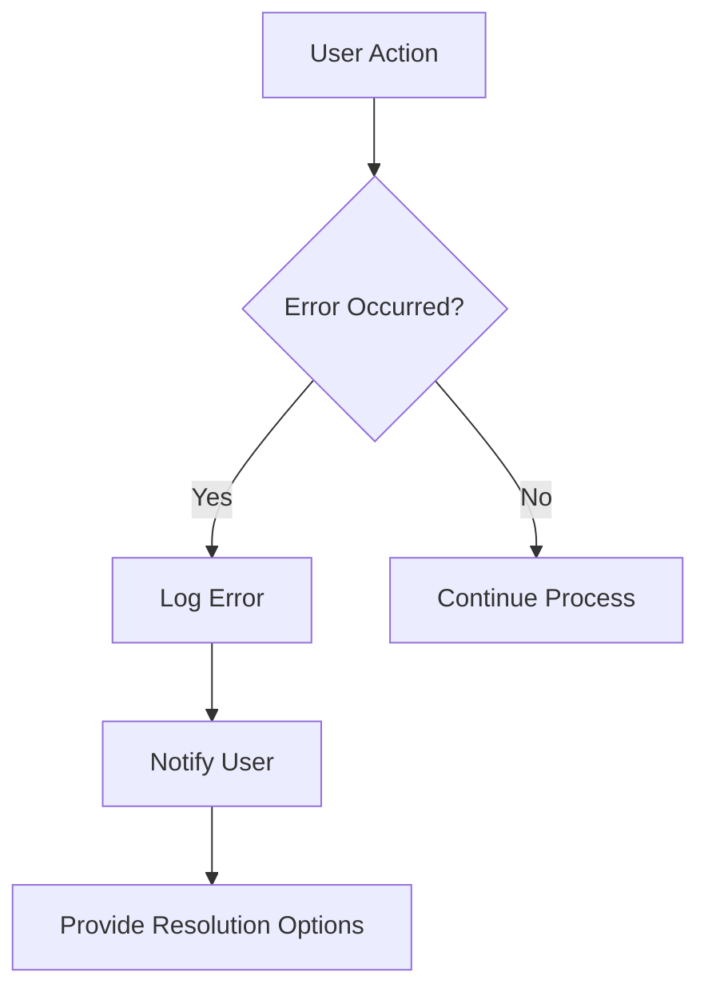

# LinkedinBlog Generator System Flow Documentation

## 1. User Workflows

### Overview
This section describes how users will interact with the LinkedinBlog Generator system to create LinkedIn posts.

### User Journey
1. **Login**: Users authenticate themselves via the system's login interface.
2. **Input Topic**: Users input a specific topic they want to generate content for.
3. **Content Customization**: Users might optionally customize the format or specific elements of the content.
4. **Generate Post**: System generates a LinkedIn post including Title, Body, and Footer.
5. **Review and Edit**: Users review the generated content and edit if necessary.
6. **Download/Share**: Users can download the content or directly share it to LinkedIn.

## 2. Data Flows

### Overview
This section describes how data moves through the system from input to output.

### Data Flow
1. **User Input**: User inputs topic data.
2. **Data Processing**: The system processes the input data and customizations.
3. **Content Generation**: The system uses an AI model to generate the LinkedIn post.
4. **Output**: The generated content is sent back to the user for review.

## 3. Integration Points

### Overview
This section identifies how different components of the system connect and interact.

### Components
- **Authentication Service**: User credentials are verified here.
- **Content Generation Engine**: The core AI model that generates the content.
- **User Interface**: Where users interact with the system.
- **LinkedIn API (Optional)**: For direct posting capabilities.

### Integration Details
- **User Interface** connects with the **Authentication Service** for user login.
- **User Interface** sends data to the **Content Generation Engine** for processing.
- **Content Generation Engine** can optionally connect with **LinkedIn API** for posting.

## 4. Error Handling

### Overview
This section describes how the system handles errors and failures.

### Error Scenarios
1. **Authentication Failure**
   - **Description**: User fails to authenticate.
   - **Handling**: Display error message and prompt for retry.

2. **Content Generation Failure**
   - **Description**: AI model fails to generate content.
   - **Handling**: Log error, display message to user indicating the failure, and suggest retry.

3. **Integration Failure**
   - **Description**: Failure in connecting to LinkedIn API.
   - **Handling**: Log error, notify user, and allow for download instead of direct posting.

### Error Flow

This documentation provides a structured approach to understanding the LinkedinBlog Generator system's user interaction, data flow, component integration, and error handling processes, ensuring clarity and support for development efforts.